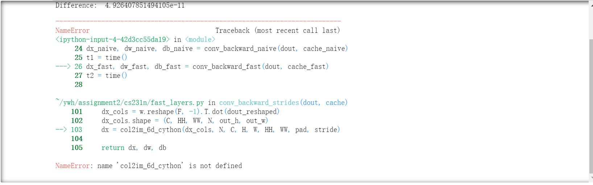

# cs231n-master2020
The finished assignment of cs231n in Stanford University 2020.

Cs231n has three assignments in 2020. I prefer jupyterbook to finish them.


### cifar-10-batches-py

This is the dataset which we need to finish our homework, and you can download from my github. Of course, you can use `sh` to download, just following the steps of [cs231n](cs231n.github.io) website which is very concrete and easy. By the way, I recommend that all your packages you need in these assignments should be downloaded in the active environment. 


### assignment1_jupyter

The first assignment is not very easy, just be careful about `future` package. The `requirements.txt` has the improper version of `future` package. You need to download a new version in active environment by following the next command.

``` python
pip install future
```

I think this is the only problem, while other problems on website I didn't face.


### assignment2_jupyter

The second assignment is much harder than the first one. Except it has much heavier work, it also need much stronger coding ability. I  will say something that most of people will meet.

* The first one is that I have watched my video on Bilibili which maybe the older version in 2016, but I have done the 2020 work. 

```python
Layer_normalization
```

`Layer_normalization` Part I have missed it.


* The second one is in `layers_util.py`, we also need two extra part. `affine_bn_relu_forward` and `affine_bn_relu_backward` Part also need to finish my homework, so I have implemented them. And you will see them in my codes.


* The third one is the biggest problem, when you need `Cpython` to implement `Fast Layers`. 

```python
name 'col2im_6d_cython' is not defined
```



Almost everyone has this problem, I will place my solutions.

Run into your `fast_layers.py`, and you will see

```python
import numpy as np
try:
  from .im2col_cython import col2im_cython, im2col_cython
  from .im2col_cython import col2im_6d_cython
except ImportError:
  print 'run the following from the cs231n directory and try again:'
  print 'python setup.py build_ext --inplace'
  print 'You may also need to restart your iPython kernel'

from .im2col import *
```

Actually it is not right, because it has wrong address, `Cpython` are in `/cs231n/`，so we just change this into:

```python
import numpy as np
try:
  from cs231n.im2col_cython import col2im_cython, im2col_cython
  from cs231n.im2col_cython import col2im_6d_cython
except ImportError:
  print 'run the following from the cs231n directory and try again:'
  print 'python setup.py build_ext --inplace'
  print 'You may also need to restart your iPython kernel'

from cs231n.im2col import *
```

And refresh the command in your teminal:

```python
python setup.py build_ext--inplace
```

You will solve this problem. Good luck!


* BTW, in the last Part: Pytorch, we trained our own model. I choose ResNet34 to be my best model, and the accuracy of it is 83.99%. It's very nice. And `ResNet_test.py` is the code to help me test which type of ResNet is my most suitable Net.